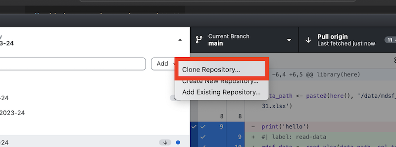
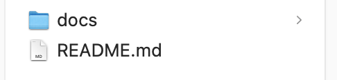
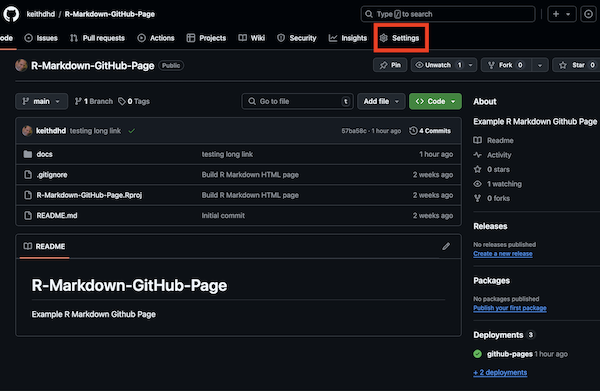
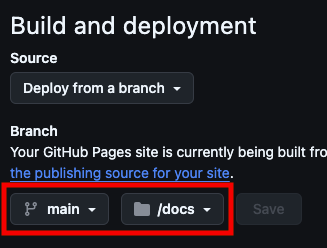

# Github Pages Instructions

For your programming assignment, we would like you to host an R Markdown knitted HTML file on Github pages.

You will need to create a new repository on Github for your assignment. <strong>Please use your exam number as the name of your repository</strong>. For example, "B261XXX".

Follow the instructions below to see how it's done!

1. Make sure you have Github Desktop installed. If not go here: https://desktop.github.com/download/
2. Create a repository on GitHub.com. Use you exam number as the name of the repository.
3. Open GitHub Desktop and clone the repository you just created.

4. Navigate to the cloned repo on your computer. Create a new folder called "docs". This is where you will save your R Markdown and html files.

5. Create a new R Markdown file in the `docs` folder and Knit it to HTML. You can add to and update it later.

6. Open Github Desktop again and commit and push your new files to Github.

7. Setup the GitHub pages features. Go to "Settings" on your Github repo page. Then click on the "Pages" link on the left hand side.

8. In the "Build and deployment" section, select the `main` branch and the `docs` folder. Click on "save". GitHub will generate a url and display it at the top of the page.This is the address of your Github page! It may take a few moments so try refreshing the page.

Attribution: [click here](https://mbounthavong.com/blog/2022/7/30/hosting-a-r-markdown-html-file-on-a-github-page) to see the instructions, courtesy of <cite>Mark Bounthavong</cite> 

## Updating your Github Page

Once you're finished your assessment, or if you want to push your latest changes, Knit your R Markdown file into HTML and use Github Desktop to push your changes to your repository. Github Pages will automatically update, although it can take a few minutes.

