# Github Pages Instructions

For your programming assignment, we would like you to host an R Markdown knitted HTML file on Github pages.

You will need to create a new repository on Github for your assignment. <strong>Please use your exam number as the name of your repository</strong>. For example, "B261XXX".

Follow the instructions below to see how it's done!

1. Make sure you have Github Desktop installed. If not go here: https://desktop.github.com/download/
2. Create a repository on GitHub.com. Use your exam number as the name of the repository.
    - Make sure to select the following options:
        - Select `Public`
        - Check `Add a README file`
        - Add a .gitignore template: R
    - Click the green `Create repository` button 

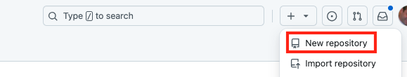

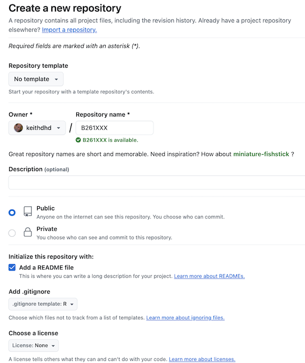

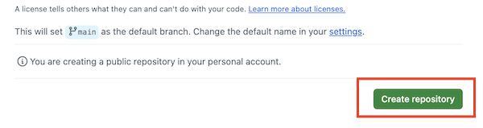

3. You will be taken to the main page of your new repository
4. Click the green `Code` button
5. Select `Open with Github Desktop`

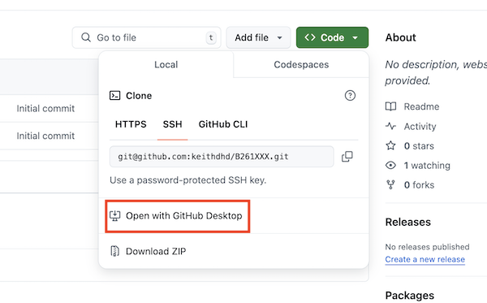

6. You will be prompted to select a `Local Path` to clone the repository to. **Make sure the Local Path is correct and you can remember where it is.** This is the location where the repo will be copied (cloned) to on your computer.  

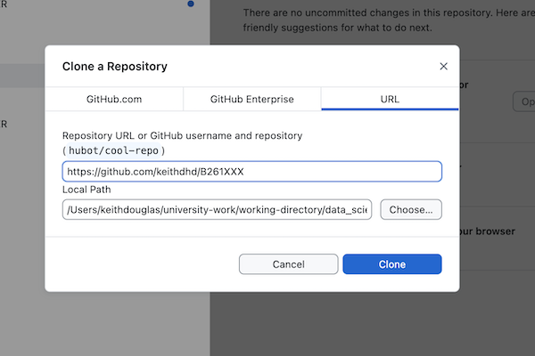

- Click the blue `Clone` button 

7. Navigate to the cloned repository on your computer with Windows File Explorer or Mac Finder. 
8. Open RStudio and navigate to your new local repository (if you have a project open, close it) and **create a new project**. 

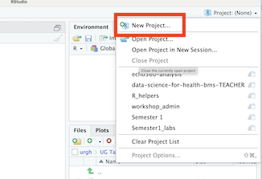

9. The `.gitignore` file contains a list of everything that will **not** be pushed up to Github. Open the `.gitignore` file. Delete the lines in the file that look like this (if they are there):

```
# pkgdown site
docs/
```

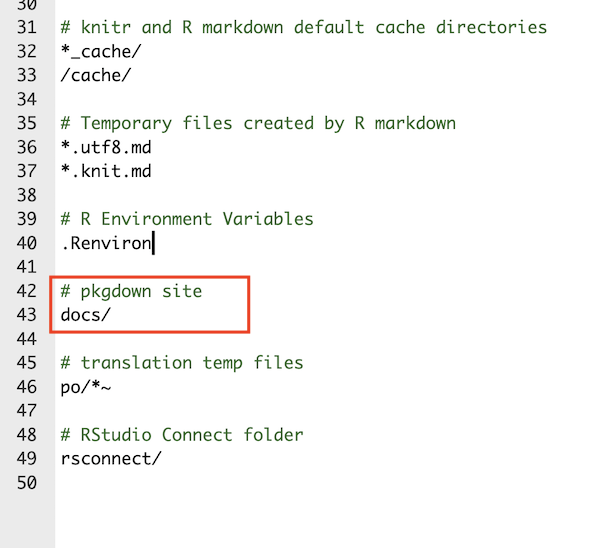

10. Save and close the `.gitignore` file

11. Create a new folder called `docs` inside the repo folder. This is where you will save your R Markdown and HTML files.

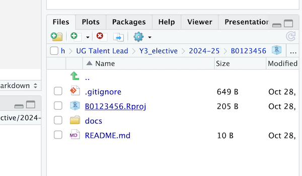

12. Create a new R Markdown file. Make the title `Assessment` and save it as `index.Rmd`in the `docs` folder. 

13. Set the Knit directory to `Document Directory`

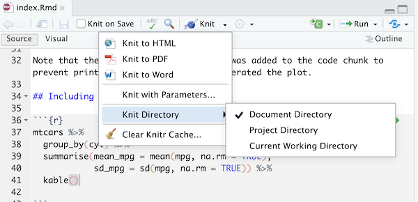


Knit it to HTML. **Make sure you save the HTML file as index.html in your docs folder**. Github Pages will look for a file called `index.html` in the docs folder to make your page so this is important. 

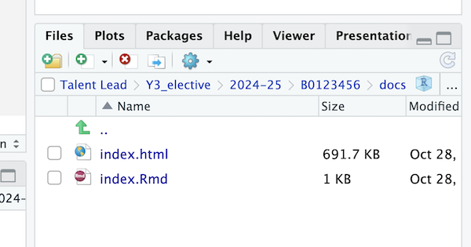

14. Open Github Desktop again, add a `Summary` (You can type "initial commit"), Commit to main and push your new files to Github.

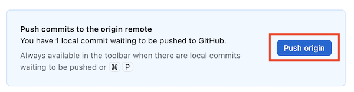

15. Setup the GitHub pages features. Go to `Settings` on your Github repo page. Then click on the `Pages` link on the left hand side.

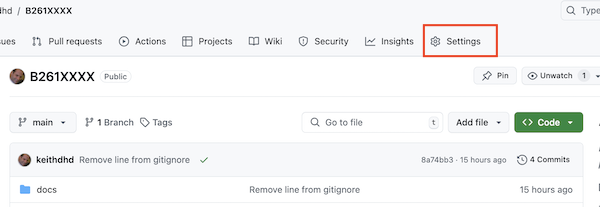

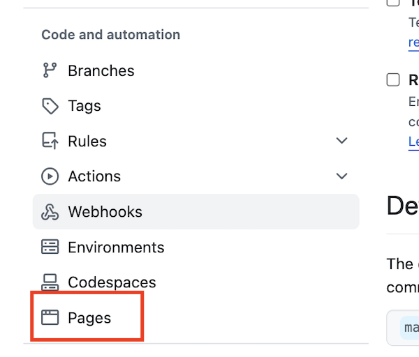

16. In the `Build and deployment` section, select the `main` branch and the `docs` folder. Click on `save`. GitHub will generate a URL and display it at the top of the page. This is the address of your Github page! It may take a few moments so try refreshing the page. Your website address will be similar to `https://keithdhd.github.io/B261XXXX/` where your Github username is the first part and the repo name is the last part.

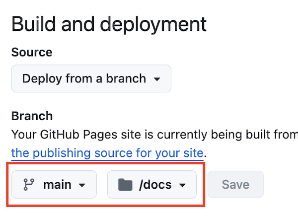


## Updating your Github Page

As you work on your assessment, it's a good idea to save and Knit often and push to Github often. 

When you've done a chunk of work:

1. Knit your R Markdown file into HTML. Make sure the new `index.html` is in your `docs` folder.
2. Open Github Desktop, add a `Summary` of what you worked on and push your changes to your repository. 
3. Github Pages will automatically update, although it can take a few minutes.
4. You can simply refresh your website (e.g. `https://keithdhd.github.io/B261XXXX/`) to see the changes after a few minutes.


## Adding a data folder

It's a good idea not to push up large data files to Github. 

1. Create a `data` folder and add add a `.csv` file in the `data` folder. 

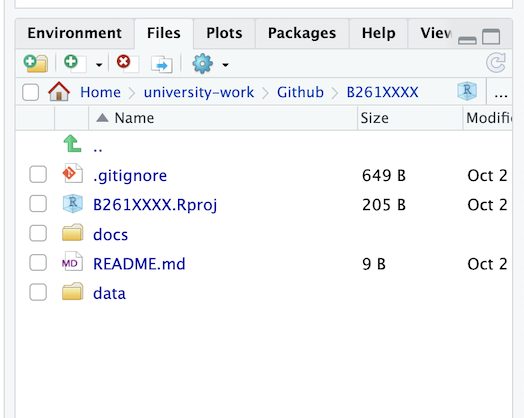

2. Open the `.gitignore` file and add the following lines at the bottom. Once you've done that, save a close the file.

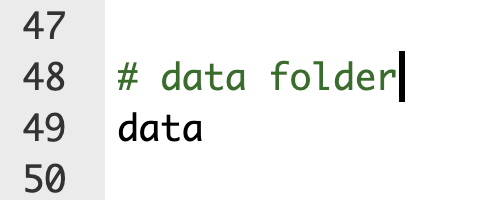    

3. Open Github Desktop, add a `Summary`, commit to main and push to your repository.

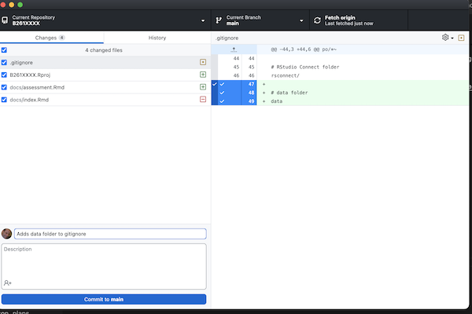

4. Check on your Github repo at Github.com that there is NO data folder. 

Attribution: [click here](https://mbounthavong.com/blog/2022/7/30/hosting-a-r-markdown-html-file-on-a-github-page) to see the instructions, courtesy of <cite>Mark Bounthavong</cite> 


