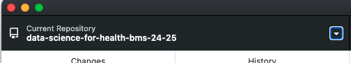
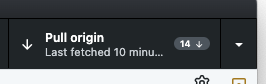
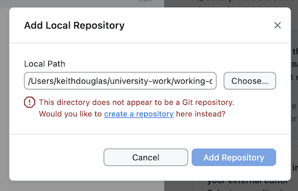
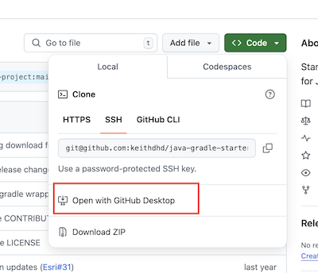
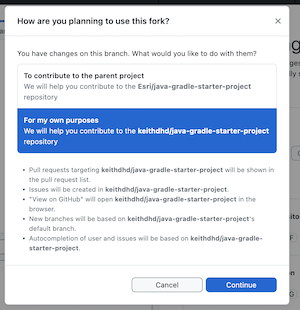

# Github Instructions

## At the beginning of the lab

To get the latest workshop materials onto your computer.

1. Open GitHub Desktop and double check that the "Current Repository" (in the top left) is **data-science-for-health-bms-24-25**. If it is not, select it from the drop down list.

> NOTE:
-  If you can't see **data-science-for-health-bms-24-25** visit the repo on Github [here](https://github.com/DDI-Students/data-science-for-health-bms-24-25)
-  Select "Code" (green button) -> Open with Github Desktop
-  In the local path select the folder you created for this course (probably `data_science`). This will make a copy of the folder from Github onto your computer.

2. Click `Pull origin` in the top right to get the latest material from the Github repository. If it says `Fetch origin`, click it just to make sure it's up to date. 

## Before you start pair programming

1. Decide whose computer you will be using.
2. Create a directory for today in the format `week_xx_xx`. For example, `week_2_thurs`
3. Open **Windows Explorer** (or **Finder** on Mac) and copy the materials from **data-science-for-health-bms-24-25** from the week_x folder - you are going to work on it in your `week_xx_xx` folder. 
4. Open the first file to be worked on in RStudio. 
5. Continue on with the lab. 

## After you've finished

After a pair programming session, you will want to save your work to Github. Here's a recommended process to follow.

## Programmer 1 (who has the code on their computer)

1. Open Github Desktop.
2. Click the top left button where it says `Current Repository`
3. Click `Add Existing Repository` -> `Add Local Repository`
4. Choose the `Local Path` where you did your work. This will be your `week_xx_xx` folder.
5. You will see a message like the one below.
6. Click "`create a repository` here instead." and fill in the details (see below)

#### Filling in the details

7. Select `Initialize this repository with a README`
8. Select the `R` Git Ignore from the dropdown.
9. Leave the License  as `None`
10. Click `Create Repository`
11. Click `Publish Repository`
12. Un-check `Keep this code private` so that your partner can see it.
13. Click `Publish Repository`

## Programmer 2 

1. In a browser, navigate to the repository your partner just created.
2. Click on the `Fork` button.
3. You now have your very own copy of the repo in your account!
4. To get a copy onto your computer, navigtate in a browser to the repo on YOUR account.
5. Click on "Code" (green button) -> Open with Github Desktop.

6. You will see a box titled **Clone Repository**.
7. Make sure the "Local Path" is the location you want to save the repo to. It should end with the name of the repository on Github. E.G. `xxx/xxx/xxx/data_science/Week_1_thurs`
8. Click the **Clone** button
9. If it asks **How are you planning to use this fork?** select **For my own purposes**

10. Click **Continue**
11. You will now have the code on your computer.

## Jargon

| Phrase   |      Meaning      | 
|:----------:|:-------------:|
| repo​ |  Short for "repository". It is a set of files and folders for one project​ |
| remote​ |    Another word for a repo on GitHub​   |
| local​ | Another word for a repo on your computer​ |
| clone​ | To make a copy of a GitHub repo on your computer​​ |
| pull (fetch)​ | To get the latest updates from a repo on to your computer​ |
| push​ | To send changes to the remote repo​​ |
| branch​ | A separate version of the same repo (main)​​ |
| commit​ | A change to a file (or set of files)​​ |
| fork | To make a copy of someone else's repo onto your account​​ |

