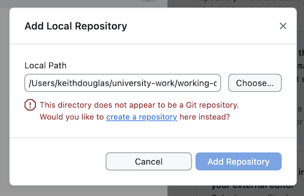

# Github Forking Instructions

After a pair programming session, you will want to save your work to Github. Here's a recommended process to follow.

## Programmer 1 (who has the code on their computer)

1. Open Github Desktop.
2. Click the top left button where it says `Current Repository`
3. Click `Add Existing Repository` -> `Add Local Repository`
5. Choose the `Local Path` where you did your work.
6. Click "`create a repository` here instead."

6. Select `Initialize this repository with a README`
7. Select the `R` Git Ignore from the dropdown.
8. Leave the License  as `None`
9. Click `Create Repository`
10. Click `Publish Repository`
11. Un-check `Keep this code private` so that your partner can see it.
12. Click `Publish Repository`

## Programmer 2 

1. In a browser, navigate to the repository your partner just created.
2. Click on the `Fork` button.
3. Yuu now have your very own copy of the repo in your account!

