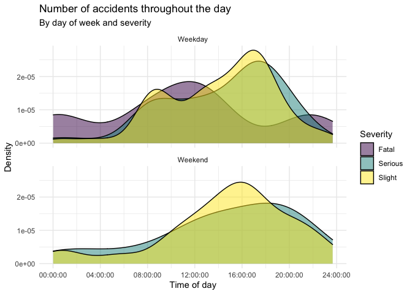

# Road traffic accidents in Edinburgh

Data vis challenge! Your task is to recreate the graph below.

The data can be found in the data directory, and it’s called `accidents` It covers all recorded accidents in Edinburgh in 2018 and some of the variables were modified for the purposes of this assignment. 

<cite>
    This exercise has been adapted from Mine Çetinkaya-Rundel, CC-BY-NC.
</cite>

